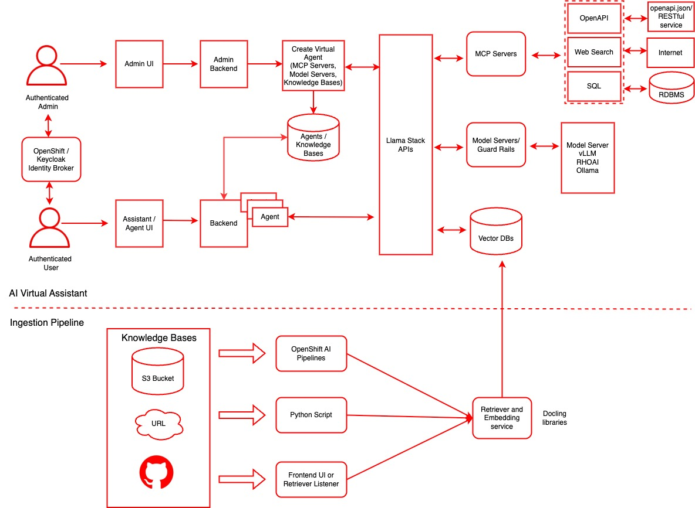

# AI Virtual Assistant

A comprehensive platform for creating and managing AI-powered virtual assistants with knowledge base integration, built on top of LlamaStack.Use this to quickly create AI Virtual Assistant for different user personas such as lawyer, accountants and marketers.

To see how it's done, jump straight to [installation](#install).

## Table of Contents

- [AI Virtual Assistant](#ai-virtual-assistant)
  - [Table of Contents](#table-of-contents)
  - [Description](#description)
    - [Use Cases](#use-cases)
  - [Architecture](#architecture)
    - [Key Features](#key-features)
    - [Technology Stack](#technology-stack)
  - [References](#references)
  - [Requirements](#requirements)
    - [Minimum hardware requirements](#minimum-hardware-requirements)
    - [Required software](#required-software)
    - [Supported Models](#supported-models)
    - [Required permissions](#required-permissions)
  - [Install](#install)
    - [Using the AI Virtual Assistant UI](#using-the-ai-virtual-assistant-ui)
  - [Developer Quick Start](#developer-quick-start)
    - [Prerequisites](#prerequisites)
    - [Basic Setup](#basic-setup)
  - [Documentation](#documentation)
  - [Community \& Support](#community--support)
  - [License](#license)

## Description

The AI Virtual Assistant platform provides a complete solution for building intelligent conversational agents that can access and reason over your organization's knowledge. The system combines modern web technologies with powerful AI capabilities to deliver a seamless experience for both developers and end users.

### Use Cases

- **Customer Support**: Create AI agents with access to product documentation and FAQ databases
- **Internal Knowledge Management**: Build intelligent assistants for employee onboarding and information access
- **Document Q&A**: Enable natural language queries over large document collections
- **Multi-modal Assistance**: Combine different AI capabilities through tool integration

## Architecture

The platform consists of several interconnected components:

- **Frontend UI**: Modern React application for user interaction
- **Backend API**: FastAPI server handling business logic and data persistence
- **LlamaStack**: AI platform managing agents, models, and inference
- **Knowledge Processing**: Kubernetes-based document ingestion pipeline
- **Database Layer**: PostgreSQL with vector extension for data storage



For detailed architecture information, see:

- [Virtual Agents Architecture Guide](docs/virtual-agents-architecture.md)
- [Knowledge Base Architecture Guide](docs/knowledge-base-architecture.md)

### Key Features

- **🤖 Virtual Agent Management**: Create, configure, and manage AI agents with different personalities and capabilities
- **📚 Knowledge Base Integration**: Upload documents and create searchable knowledge bases for RAG (Retrieval-Augmented Generation)
- **💬 Real-time Chat**: Stream-based chat interface with Server-Sent Events for responsive conversations
- **🔧 Tool Integration**: Support for built-in tools (RAG, web search) and external MCP (Model Context Protocol) servers
- **🛡️ Safety & Guardrails**: Configurable input/output shields and safety measures
- **📊 Session Management**: Persistent chat sessions with history and metadata
- **🏗️ Scalable Architecture**: Production-ready deployment with Kubernetes and containerization

### Technology Stack

- **Frontend**: React + TypeScript + PatternFly UI + TanStack Router/Query
- **Backend**: FastAPI + SQLAlchemy + PostgreSQL + Alembic
- **AI Platform**: LlamaStack for agent management and inference
- **Vector Storage**: pgvector for knowledge base embeddings
- **Document Processing**: Kubeflow Pipelines + Docling for ingestion
- **Infrastructure**: Kubernetes + Helm + MinIO for object storage

## References

- [Virtual Assistant/Agent Platform Demos](https://www.youtube.com/watch?v=Trw9JyBJiyU&t=1787s)
- Azure AI Foundry Agent Service (including Assistants->Agents)
- [Virtual Assistant Podcast](https://www.youtube.com/watch?v=QjJ2HrOa3J0)

## Requirements

### Minimum hardware requirements

- 1 GPU with 24GB of VRAM for the LLM, refer to the chart below
- 1 GPU with 24GB of VRAM for the safety/shield model (optional)

### Required software

- OpenShift Cluster 4.16+ with OpenShift AI 2.19+
- OpenShift Client CLI - [oc](https://docs.redhat.com/en/documentation/openshift_container_platform/4.18/html/cli_tools/openshift-cli-oc#installing-openshift-cli)
- Helm CLI - helm
- [huggingface-cli](https://huggingface.co/docs/huggingface_hub/guides/cli) (optional)
- [Hugging Face Token](https://huggingface.co/settings/tokens)
- Access to [Meta Llama](https://huggingface.co/meta-llama/Llama-3.2-3B-Instruct/) model.
- Access to [Meta Llama Guard](https://huggingface.co/meta-llama/Llama-Guard-3-8B/) model.

### Supported Models

| Function    | Model Name                             | GPU         | AWS
|-------------|----------------------------------------|-------------|-------------
| Embedding   | `all-MiniLM-L6-v2`                     | CPU or GPU  |
| Generation  | `meta-llama/Llama-3.2-3B-Instruct`     | L4          | g6.2xlarge
| Generation  | `meta-llama/Llama-3.1-8B-Instruct`     | L4          | g6.2xlarge
| Generation  | `meta-llama/Meta-Llama-3-70B-Instruct` | A100 x2     | p4d.24xlarge
| Safety      | `meta-llama/Llama-Guard-3-8B`          | L4          | g6.2xlarge

Note: the 70B model is NOT required for initial testing of this example.  The safety/shield model `Llama-Guard-3-8B` is also optional.

### Required permissions

*Section is required. Describe the permissions the user will need. Cluster
admin? Regular user?*

## Install

1. Clone the repo so you have a working copy

```bash
git clone https://github.com/rh-ai-kickstart/ai-virtual-assistant
```

2. Login to your OpenShift Cluster

```bash
oc login --server="<cluster-api-endpoint>" --token="sha256~XYZ"
```

3. If the GPU nodes are tainted, find the taint key. You will have to pass in the
   make command to ensure that the llm pods are deployed on the tainted nodes with GPU.
   In the example below the key for the taint is `nvidia.com/gpu`

```bash
oc get nodes -l nvidia.com/gpu.present=true -o yaml | grep -A 3 taint 
```

The output of the command may be something like below

```
  taints:
    - effect: NoSchedule
      key: nvidia.com/gpu
      value: "true"
--
    taints:
    - effect: NoSchedule
      key: nvidia.com/gpu
      value: "true"
```

You can work with your OpenShift cluster admin team to determine what labels and taints identify GPU-enabled worker nodes.  It is also possible that all your worker nodes have GPUs therefore have no distinguishing taint.

4. Navigate to Helm deploy directory

```bash
cd deploy/helm
```

5. List available models

```bash
make list-models
```

The above command will list the models to use in the next command

```bash
(Output)
model: llama-3-1-8b-instruct (meta-llama/Llama-3.1-8B-Instruct)
model: llama-3-2-1b-instruct (meta-llama/Llama-3.2-1B-Instruct)
model: llama-3-2-1b-instruct-quantized (RedHatAI/Llama-3.2-1B-Instruct-quantized.w8a8)
model: llama-3-2-3b-instruct (meta-llama/Llama-3.2-3B-Instruct)
model: llama-3-3-70b-instruct (meta-llama/Llama-3.3-70B-Instruct)
model: llama-guard-3-1b (meta-llama/Llama-Guard-3-1B)
model: llama-guard-3-8b (meta-llama/Llama-Guard-3-8B)
```

The "guard" models can be used to test shields for profanity, hate speech, violence, etc.

6. Install via make

Use the taint key from above as the `LLM_TOLERATION` and `SAFETY_TOLERATION`

The namespace will be auto-created

To install only the AI Virtual Assistant without shields, use the following command:

```bash
make install NAMESPACE=ai-virtual-assistant LLM=llama-3-1-8b-instruct LLM_TOLERATION="nvidia.com/gpu"
```

To install AI Virtual Assistant with the guard model to allow for shields, use the following command:

```bash
make install NAMESPACE=ai-virtual-assistant LLM=llama-3-1-8b-instruct LLM_TOLERATION="nvidia.com/gpu" SAFETY=llama-guard-3-8b SAFETY_TOLERATION="nvidia.com/gpu"
```

If you have no tainted nodes, perhaps every worker node has a GPU, then you can use a simplified version of the make command

```bash
make install NAMESPACE=ai-virtual-assistant LLM=llama-3-1-8b-instruct SAFETY=llama-guard-3-8b
```

When prompted, enter your **[Hugging Face Token]((https://huggingface.co/settings/tokens))**.

Note: This process may take 10 to 30 minutes depending on the number and size of models to be downloaded.

1. Watch/Monitor

```bash
oc get pods -n ai-virtual-assistant
```

```
(Output)
NAME                                                                READY   STATUS      RESTARTS   AGE
add-default-ingestion-pipeline-brfbb                                0/1     Completed   0          10m
ai-virtual-assistant-854f8588dc-86kmb                               2/2     Running     0          10m
ai-virtual-assistant-fnc6j                                          0/1     Completed   3          10m
ai-virtual-assistant-ingestion-pipeline-6dcb65b4fc-mxmp9            1/1     Running     0          10m
ai-virtual-assistant-mcp-weather-646654864d-j8wbh                   1/1     Running     0          10m
ds-pipeline-dspa-855d64dcdc-gqtqw                                   2/2     Running     0          10m
ds-pipeline-metadata-envoy-dspa-7759f8589d-vhcvx                    2/2     Running     0          10m
ds-pipeline-metadata-grpc-dspa-6df7dbc65d-r4svx                     1/1     Running     0          10m
ds-pipeline-persistenceagent-dspa-c84c998bb-x2jnc                   1/1     Running     0          10m
ds-pipeline-scheduledworkflow-dspa-7f4cbfbb6f-vd6fz                 1/1     Running     0          10m
ds-pipeline-workflow-controller-dspa-dd69bddd6-5tj9b                1/1     Running     0          10m
fetch-and-store-pipeline-m6kbg-system-container-driver-3649736823   0/2     Completed   0          10m
fetch-and-store-pipeline-m6kbg-system-container-driver-662109129    0/2     Completed   0          10m
fetch-and-store-pipeline-m6kbg-system-container-impl-1096845703     0/2     Completed   0          10m
fetch-and-store-pipeline-m6kbg-system-container-impl-3659398265     0/2     Completed   0          10m
fetch-and-store-pipeline-m6kbg-system-dag-driver-1735541709         0/2     Completed   0          10m
ingestion-pipeline-monitor-85585696d4-d67zx                         2/2     Running     0          10m
llama-3-2-3b-instruct-predictor-00001-deployment-6bbf96f8674677     3/3     Running     0          10m
llamastack-6dc8bdd5c4-vpft7                                         1/1     Running     0          10m
mariadb-dspa-9bc764fdf-pq8wd                                        1/1     Running     0          10m
minio-0                                                             1/1     Running     0          10m
minio-dspa-68bf8b6947-dsxpv                                         1/1     Running     0          10m
pgvector-0                                                          1/1     Running     0          10m
rag-pipeline-notebook-0                                             2/2     Running     0          10m
upload-sample-docs-job-zlc74                                        0/1     Completed   0          10m

```

8. Verify:

```bash
oc get pods -n ai-virtual-assistant
oc get svc -n ai-virtual-assistant
oc get routes -n ai-virtual-assistant
```

Note: The key pods to watch include **predictor** in their name, those are the kserve model servers running vLLM

```bash
oc get pods -l component=predictor
```

Look for **3/3** under the Ready column

The **inferenceservice** CR describes the limits, requests, model name, serving-runtime, chat-template, etc.

```bash
oc get inferenceservice llama-3-1-8b-instruct \
  -n ai-virtual-assistant \
  -o jsonpath='{.spec.predictor.model}' | jq
```

Watch the **llamastack** pod as that one becomes available after all the model servers are up.

```bash
 oc get pods -l app.kubernetes.io/name=llamastack
```

### Using the AI Virtual Assistant UI

1. Get the route url for the application and open in your browser

```bash
URL=http://$(oc get routes -l app.kubernetes.io/name=rag -o jsonpath="{range .items[*]}{.status.ingress[0].host}{end}")
echo $URL
open $URL

## Uninstalling the AI Virtual Assistant application

```bash
make uninstall NAMESPACE=ai-virtual-assistant
```

or

```bash
oc delete project ai-virtual-assistant
```

## Developer Quick Start

Ready to get started? Check out our [Contributing Guide](CONTRIBUTING.md) for detailed setup instructions, development workflows, and deployment options.

### Prerequisites

- Python 3.10+
- Node.js 18+
- PostgreSQL 14+
- Podman or Docker
- LlamaStack instance

### Basic Setup

1. **Clone the repository**

   ```bash
   git clone https://github.com/RHEcosystemAppEng/ai-virtual-assistant
   cd ai-virtual-assistant
   ```

2. **Follow the setup guide**

   See [CONTRIBUTING.md](CONTRIBUTING.md) for complete setup instructions including:
   - Database configuration
   - Backend server setup
   - Frontend development server
   - Container deployment

## Documentation

- **[Contributing Guide](CONTRIBUTING.md)** - Setup, development, and contribution guidelines
- **[Virtual Agents Architecture](docs/virtual-agents-architecture.md)** - How AI agents work in the platform
- **[Knowledge Base Architecture](docs/knowledge-base-architecture.md)** - Document ingestion and RAG system
- **[Backend README](backend/README.md)** - Backend API documentation and features

## Community & Support

- **Issues**: Report bugs and request features via [GitHub Issues](https://github.com/RHEcosystemAppEng/ai-virtual-assistant/issues)
- **Contributing**: See [CONTRIBUTING.md](CONTRIBUTING.md) for development setup and guidelines

## License

This project is licensed under the [MIT LICENSE](LICENSE) - see the LICENSE file for details.

---

**Built with ❤️ by the Red Hat Ecosystem App Engineering team**
