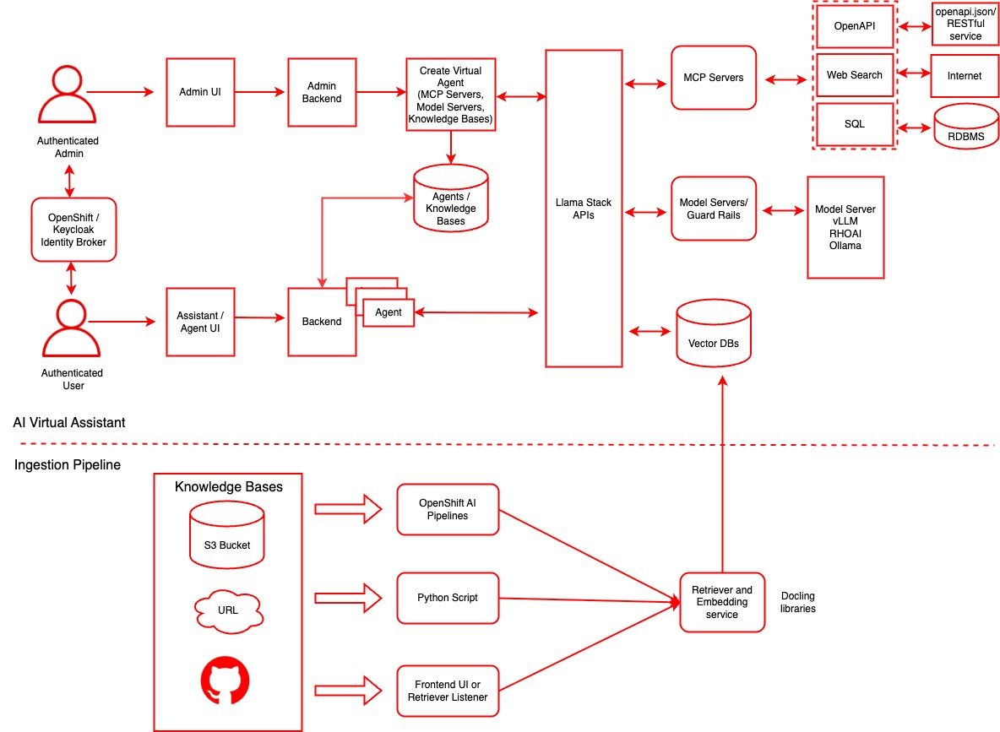

# Virtual Assistant/Agent

Welcome to the Virtual Assistant/Agent Kickstart!  

Use this to quickly create AI Virtual Assistant for different user personas such as lawyer, accountants and marketers.

To see how it's done, jump straight to [installation](#install).

## Table of Contents

- [Virtual Assistant/Agent](#virtual-assistantagent)
  - [Table of Contents](#table-of-contents)
  - [Description](#description)
  - [Architecture diagrams](#architecture-diagrams)
  - [High-Level Features](#high-level-features)
  - [References](#references)
  - [Requirements](#requirements)
    - [Minimum hardware requirements](#minimum-hardware-requirements)
    - [Required software](#required-software)
    - [Supported Models](#supported-models)
    - [Required permissions](#required-permissions)
  - [Install](#install)
    - [Using the AI Virtual Assistant UI](#using-the-ai-virtual-assistant-ui)
  - [Adding a new model](#adding-a-new-model)

## Description

Every employee/department can have a virtual assistant that helps them manage their calendar, filter inbound emails/slack, organize customer follow-ups, summarize meeting recordings, monitor campaigns, and provide a public FAQ.  Coordinating the team luncheon is one of the primary [demos](https://youtu.be/Trw9JyBJiyU?t=1787) you see in this space as it is obviously labor-intensive, requires a great deal of “back and forth”, inside of every enterprise, and painful/unwanted job-to-be-done.

The Virtual Assistant/Agent blueprint has three-sides, one for end-users (e.g. accountants, lawyers, marketers), one for devs (e.g. devs who write MCP servers and/or extend the base code) and one for administrators.  

Virtual Assistant versus Agent:  The agent variant has access tools and can take actions via those tools.  For example, an assistant might identify the best course of action and recommend that you, the human in the loop, create a calendar invite.  An agent would auto-create that calendar invite.  

A virtual assistant solution builds on the concepts seen in the RAG blueprint as the first user experience is typically a “chat with private docs” scenario.  The primary differences include end-user authentication, the ability to manage access and assets across teams/groups, and the ability to create/maintain multiple assistants/agents that have: chat-ui, prompt/instructions, triggers, models, knowledge/resources, tools and guardrails.

Scope: Text to Text models to start.  Image to Text in the future.

## Architecture diagrams



## High-Level Features

- Name: Name of the agent
- Prompt/Instructions: Natural language instructions
- Triggers: Human initiated chat today, futures include API call, Slack, Jira, etc
- Models: Limited to single model per assistant/agent
- Knowledge/Resources: user provided docs or attach to pre-ingestion pipeline. This knowledge grounds the conversation and provides context to “chat” and interactions
- Tools: MCP servers for SQL (bring your own RDBMs), OpenAPI (bring your own APIs), Web Search (bring the whole internet), and Slack (send/receive)
- Guardrails: by the admin, auto-applied to all assistants/agents
- Admin UX: Basic user management, model curation, tool curation, knowledge/resource curation, guardrail configuration and analytics.  The first user is the default admin.

## References

- [Virtual Assistant/Agent Platform Demos](https://www.youtube.com/watch?v=Trw9JyBJiyU&t=1787s)
- Azure AI Foundry Agent Service (including Assistants->Agents)
- [Virtual Assistant Podcast](https://www.youtube.com/watch?v=QjJ2HrOa3J0)

## Requirements

### Minimum hardware requirements

- 1 GPU with 24GB of VRAM for the LLM, refer to the chart below
- 1 GPU with 24GB of VRAM for the safety/shield model (optional)

### Required software

- OpenShift Cluster 4.16+ with OpenShift AI 2.19+
- OpenShift Client CLI - [oc](https://docs.redhat.com/en/documentation/openshift_container_platform/4.18/html/cli_tools/openshift-cli-oc#installing-openshift-cli)
- Helm CLI - helm
- [huggingface-cli](https://huggingface.co/docs/huggingface_hub/guides/cli) (optional)
- [Hugging Face Token](https://huggingface.co/settings/tokens)
- Access to [Meta Llama](https://huggingface.co/meta-llama/Llama-3.2-3B-Instruct/) model.
- Access to [Meta Llama Guard](https://huggingface.co/meta-llama/Llama-Guard-3-8B/) model.

### Supported Models

| Function    | Model Name                             | GPU         | AWS
|-------------|----------------------------------------|-------------|-------------
| Embedding   | `all-MiniLM-L6-v2`                     | CPU or GPU  |
| Generation  | `meta-llama/Llama-3.2-3B-Instruct`     | L4          | g6.2xlarge
| Generation  | `meta-llama/Llama-3.1-8B-Instruct`     | L4          | g6.2xlarge
| Generation  | `meta-llama/Meta-Llama-3-70B-Instruct` | A100 x2     | p4d.24xlarge
| Safety      | `meta-llama/Llama-Guard-3-8B`          | L4          | g6.2xlarge

Note: the 70B model is NOT required for initial testing of this example.  The safety/shield model `Llama-Guard-3-8B` is also optional.

### Required permissions

*Section is required. Describe the permissions the user will need. Cluster
admin? Regular user?*

## Install

1. Clone the repo so you have a working copy

```bash
git clone https://github.com/rh-ai-kickstart/ai-virtual-assistant
```

2. Login to your OpenShift Cluster

```bash
oc login --server="<cluster-api-endpoint>" --token="sha256~XYZ"
```

3. If the GPU nodes are tainted, find the taint key. You will have to pass in the
   make command to ensure that the llm pods are deployed on the tainted nodes with GPU.
   In the example below the key for the taint is `nvidia.com/gpu`

```bash
oc get nodes -l nvidia.com/gpu.present=true -o yaml | grep -A 3 taint 
```

The output of the command may be something like below

```
  taints:
    - effect: NoSchedule
      key: nvidia.com/gpu
      value: "true"
--
    taints:
    - effect: NoSchedule
      key: nvidia.com/gpu
      value: "true"
```

You can work with your OpenShift cluster admin team to determine what labels and taints identify GPU-enabled worker nodes.  It is also possible that all your worker nodes have GPUs therefore have no distinguishing taint.

4. Navigate to Helm deploy directory

```bash
cd deploy/helm
```

5. List available models

```bash
make list-models
```

The above command will list the models to use in the next command

```bash
(Output)
model: llama-3-1-8b-instruct (meta-llama/Llama-3.1-8B-Instruct)
model: llama-3-2-1b-instruct (meta-llama/Llama-3.2-1B-Instruct)
model: llama-3-2-1b-instruct-quantized (RedHatAI/Llama-3.2-1B-Instruct-quantized.w8a8)
model: llama-3-2-3b-instruct (meta-llama/Llama-3.2-3B-Instruct)
model: llama-3-3-70b-instruct (meta-llama/Llama-3.3-70B-Instruct)
model: llama-guard-3-1b (meta-llama/Llama-Guard-3-1B)
model: llama-guard-3-8b (meta-llama/Llama-Guard-3-8B)
```

The "guard" models can be used to test shields for profanity, hate speech, violence, etc.

6. Install via make

Use the taint key from above as the `LLM_TOLERATION` and `SAFETY_TOLERATION`

The namespace will be auto-created

To install only the AI Virtual Assistant without shields, use the following command:

```bash
make install NAMESPACE=ai-virtual-assistant LLM=llama-3-1-8b-instruct LLM_TOLERATION="nvidia.com/gpu"
```

To install AI Virtual Assistant with the guard model to allow for shields, use the following command:

```bash
make install NAMESPACE=ai-virtual-assistant LLM=llama-3-1-8b-instruct LLM_TOLERATION="nvidia.com/gpu" SAFETY=llama-guard-3-8b SAFETY_TOLERATION="nvidia.com/gpu"
```

If you have no tainted nodes, perhaps every worker node has a GPU, then you can use a simplified version of the make command

```bash
make install NAMESPACE=ai-virtual-assistant LLM=llama-3-1-8b-instruct SAFETY=llama-guard-3-8b
```

When prompted, enter your **[Hugging Face Token]((https://huggingface.co/settings/tokens))**.

Note: This process may take 10 to 30 minutes depending on the number and size of models to be downloaded.

1. Watch/Monitor

```bash
oc get pods -n ai-virtual-assistant
```

```
(Output)
NAME                                                               READY   STATUS      RESTARTS   AGE
demo-rag-vector-db-v1-0-8mkf9                                      0/1     Completed   0          10m
ds-pipeline-dspa-7788689675-9489m                                  2/2     Running     0          10m
ds-pipeline-metadata-envoy-dspa-948676f89-8knw8                    2/2     Running     0          10m
ds-pipeline-metadata-grpc-dspa-7b4bf6c977-cb72m                    1/1     Running     0          10m
ds-pipeline-persistenceagent-dspa-ff9bdfc76-ngddb                  1/1     Running     0          10m
ds-pipeline-scheduledworkflow-dspa-7b64d87fd8-58d87                1/1     Running     0          10m
ds-pipeline-workflow-controller-dspa-5799548b68-bxpdp              1/1     Running     0          10m
fetch-and-store-pipeline-tmxwj-system-container-driver-287597120   0/2     Completed   0          3m43s
fetch-and-store-pipeline-tmxwj-system-container-driver-922184592   0/2     Completed   0          2m54s
fetch-and-store-pipeline-tmxwj-system-container-impl-3210250134    0/2     Completed   0          4m33s
fetch-and-store-pipeline-tmxwj-system-container-impl-3248801382    0/2     Completed   0          3m32s
fetch-and-store-pipeline-tmxwj-system-dag-driver-3443954210        0/2     Completed   0          4m6s
llama-3-2-3b-instruct-predictor-00001-deployment-6bbf96f8674677    3/3     Running     0          10m
llamastack-6d5c5b999b-5lffb                                        1/1     Running     0          11m
mariadb-dspa-74744d65bd-fdxjd                                      1/1     Running     0          10m
minio-0                                                            1/1     Running     0          10m
minio-dspa-7bb47d68b4-nvw7t                                        1/1     Running     0          10m
pgvector-0                                                         1/1     Running     0          10m
rag-7fd7b47844-nlfvr                                               1/1     Running     0          11m
rag-mcp-weather-9cc97d574-nf5q8                                    1/1     Running     0          11m
rag-pipeline-notebook-0                                            2/2     Running     0          10m
upload-sample-docs-job-f5k5w                                       0/1     Completed   0          10m
```

8. Verify:

```bash
oc get pods -n ai-virtual-assistant
oc get svc -n ai-virtual-assistant
oc get routes -n ai-virtual-assistant
```

Note: The key pods to watch include **predictor** in their name, those are the kserve model servers running vLLM

```bash
oc get pods -l component=predictor
```

Look for **3/3** under the Ready column

The **inferenceservice** CR describes the limits, requests, model name, serving-runtime, chat-template, etc.

```bash
oc get inferenceservice llama-3-1-8b-instruct \
  -n ai-virtual-assistant \
  -o jsonpath='{.spec.predictor.model}' | jq
```

Watch the **llamastack** pod as that one becomes available after all the model servers are up.

```bash
 oc get pods -l app.kubernetes.io/name=llamastack
```

### Using the AI Virtual Assistant UI

1. Get the route url for the application and open in your browser

```bash
URL=http://$(oc get routes -l app.kubernetes.io/name=rag -o jsonpath="{range .items[*]}{.status.ingress[0].host}{end}")
echo $URL
open $URL

## Uninstalling the AI Virtual Assistant application

```bash
make uninstall NAMESPACE=ai-virtual-assistant
```

or

```bash
oc delete project ai-virtual-assistant
```

## Adding a new model

To add another model follow these steps:

1. Edit `deploy\helm\ai-virtual-assistant\values.yaml`

    Update the **global\models** section

    ```yaml
    global:
      models:
        granite-vision-3-2-2b:
          id: ibm-granite/granite-vision-3.2-2b
          enabled: true      
          resources:
            limits:
              nvidia.com/gpu: "1"
          tolerations:
          - key: "nvidia.com/gpu"
            operator: Exists
            effect: NoSchedule
          args:
          - --tensor-parallel-size
          - "1"
          - --max-model-len
          - "6144"
          - --enable-auto-tool-choice
          - --tool-call-parser
          - granite
        llama-guard-3-8b:
          id: meta-llama/Llama-Guard-3-8B
          enabled: true
          registerShield: true
          tolerations:
          - key: "nvidia.com/gpu"
            operator: Exists
            effect: NoSchedule
          args:
          - --max-model-len
          - "14336"
    ```

  Note: Make sure you have permission to download the models from Huggingface and enough GPUs to support all the models you have requested.  Also **max-model-len** uses additional VRAM therefore you have to scale that parameter to fit your hardware.

2. Run the **make** command again to update the project

    ```bash
    make install NAMESPACE=ai-virtual-assistant LLM=llama-3-2-3b-instruct LLM_TOLERATION="nvidia.com/gpu"
    ```

    ```bash
    (Output)
    NAME                                                                READY   STATUS                   RESTARTS      AGE
    demo-rag-vector-db-v1-0-vz5mf                                       0/1     Completed                0             35m
    ds-pipeline-dspa-6dcf8c7b8f-vkhw8                                   2/2     Running                  1 (34m ago)   34m
    ds-pipeline-metadata-envoy-dspa-7659ddc8d9-qvtct                    2/2     Running                  0             34m
    ds-pipeline-metadata-grpc-dspa-8665cd5c6c-mfrj7                     1/1     Running                  0             34m
    ds-pipeline-persistenceagent-dspa-56f888bc78-lzq9s                  1/1     Running                  0             34m
    ds-pipeline-scheduledworkflow-dspa-c94d5c95d-rr8td                  1/1     Running                  0             34m
    ds-pipeline-workflow-controller-dspa-5799548b68-z2lcl               1/1     Running                  0             34m
    fetch-and-store-pipeline-w7gxh-system-container-driver-1552269565   0/2     Completed                0             30m
    fetch-and-store-pipeline-w7gxh-system-container-driver-2057025395   0/2     Completed                0             30m
    fetch-and-store-pipeline-w7gxh-system-container-impl-1487941461     0/2     Completed                0             30m
    fetch-and-store-pipeline-w7gxh-system-container-impl-883889707      0/2     Completed                0             29m
    fetch-and-store-pipeline-w7gxh-system-dag-driver-190510417          0/2     Completed                0             30m
    granite-vision-3-2-2b-predictor-00001-deployment-5dbcf6f454mrd6     3/3     Running                  0             10m
    granite-vision-3-2-2b-predictor-00001-deployment-5dbcf6f45xxk5x     0/3     ContainerStatusUnknown   3             13m
    llama-3-2-3b-instruct-predictor-00001-deployment-6f845f65674ncq     3/3     Running                  0             35m
    llama-guard-3-8b-predictor-00001-deployment-6cbff4965c-gzx5v        3/3     Running                  0             13m
    llamastack-7989d974fc-w24fn                                         1/1     Running                  0             13m
    mariadb-dspa-74744d65bd-kb2dh                                       1/1     Running                  0             35m
    minio-0                                                             1/1     Running                  0             35m
    minio-dspa-7bb47d68b4-kb722                                         1/1     Running                  0             35m
    pgvector-0                                                          1/1     Running                  0             35m
    rag-7fd7b47844-jkqtf                                                1/1     Running                  0             35m
    rag-mcp-weather-9cc97d574-s8vpt                                     1/1     Running                  0             35m
    rag-pipeline-notebook-0                                             2/2     Running                  0             35m
    upload-sample-docs-job-952gj                                        0/1     Completed                0             35m
  